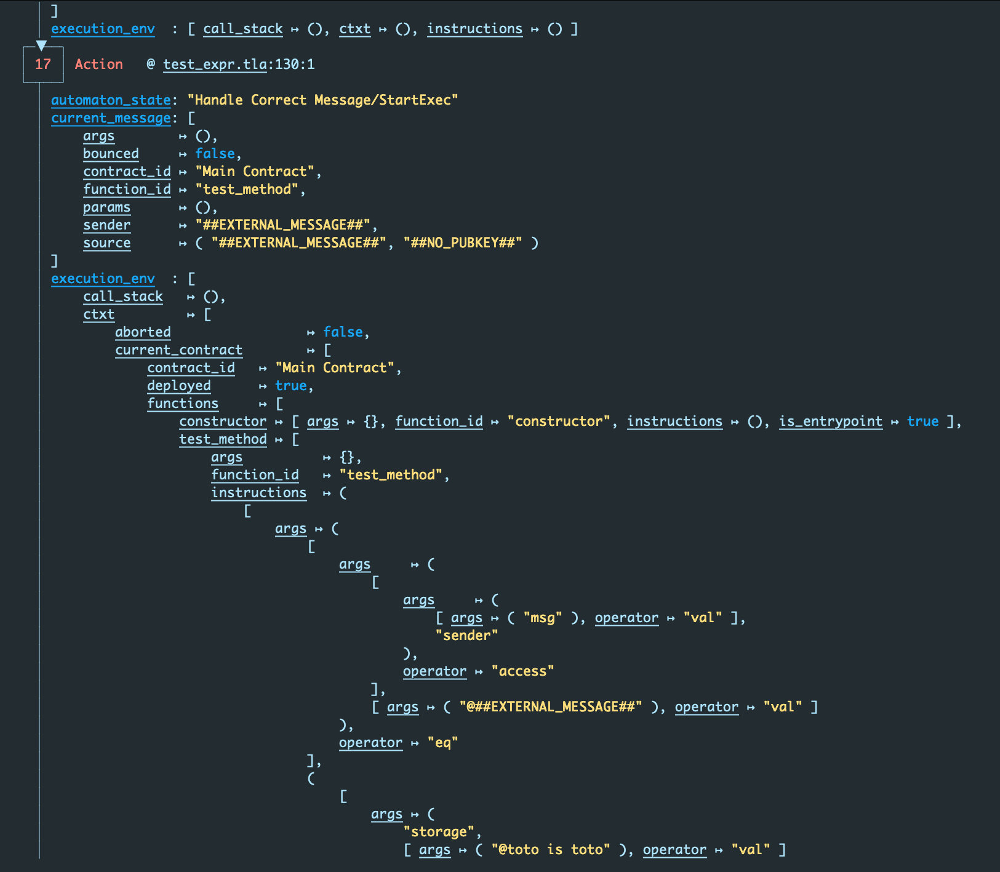

# Running: counterexample traces

> Matla project sources for this section available [here][run/cex] and [here (temporal version)][run/temporal_cex].

Remember the candidate invariants from our running example:

```text
> bat -r 29:32 sw_0.tla
───────┬────────────────────────────────────────────────────────────────────────
       │ File: sw_0.tla
───────┼────────────────────────────────────────────────────────────────────────
  29   │ inv_cnt_pos == cnt >= 0
  30   │ inv_reset == reset => (cnt = 0)
  31   │
  32   │ cnt_leq_10 == cnt <= 10
───────┴────────────────────────────────────────────────────────────────────────
```

Predicate `cnt_leq_10` does not hold: the stopwatch *can* count up to `59`, at which points it
cannot increase anymore.

Let's see what happens if we add it as a candidate invariant.

```text
> bat sw_0.cfg
───────┬────────────────────────────────────────────────────────────────────────
       │ File: sw_0.cfg
───────┼────────────────────────────────────────────────────────────────────────
   1   │ INIT init
   2   │ NEXT next
   3   │
   4   │ INVARIANTS
   5   │     inv_cnt_pos
   6   │     inv_reset
   7   │     cnt_leq_10
───────┴────────────────────────────────────────────────────────────────────────
```

This is a good opportunity to showcase matla's fancy, colored, UTF-8-art output so let's see what it
looks like on a screenshot.


For whatever reason, some people don't like command-line tools that have nice colored output. Note
that matla has a `--color` option: `matla --color off run` or `matla -c off run` which disables
matla's colored output.

This toy example is still readable in colorless mode, but counterexample traces on projects
manipulating tuples, bags, sets... values benefit greatly from syntax highlighting. Here is a very
small part of a huge counterexample trace for a relatively big project:



For readers wondering what a counterexample trace for a temporal property looks like, let's add the
bogus temporal property that "if `cnt = 1` at some point, then eventually `cnt = 10`". Which, if
you followed, should not hold.

```text
> bat -r 29:34 sw_0.tla
───────┬────────────────────────────────────────────────────────────────────────
       │ File: sw_0.tla
───────┼────────────────────────────────────────────────────────────────────────
  29   │ inv_cnt_pos == cnt >= 0
  30   │ inv_reset == reset => (cnt = 0)
  31   │
  32   │ cnt_leq_10 == cnt <= 10
  33   │
  34   │ well_thats_gonna_fail == (cnt = 1) ~> (cnt = 10)
───────┴────────────────────────────────────────────────────────────────────────
```

Then we activate the property in the `.cfg`:

```text
{{ #include code/temporal_cex/sw_0.cfg }}
```

And *voilà*:


[run/cex]: https://github.com/OCamlPro/matla/tree/latest/docs/manual/src/run/code/cex
[run/temporal_cex]: https://github.com/OCamlPro/matla/tree/latest/docs/manual/src/run/code/temporal_cex
