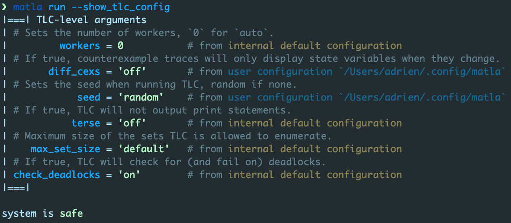
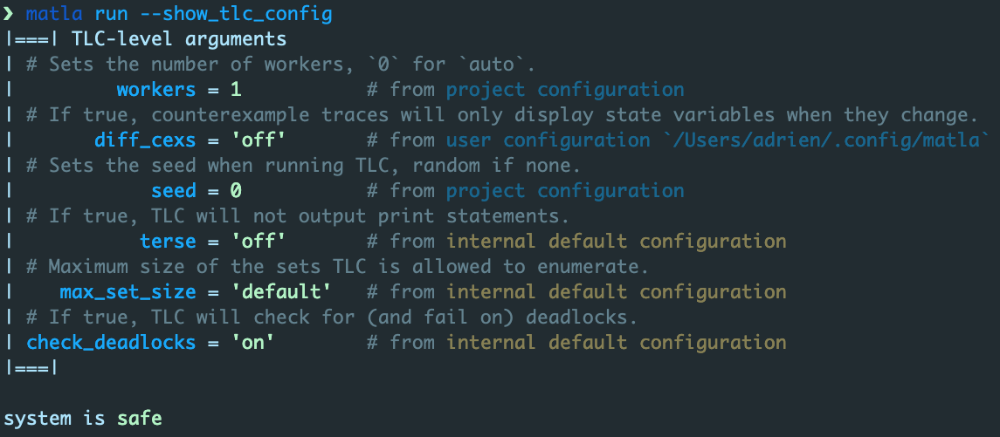
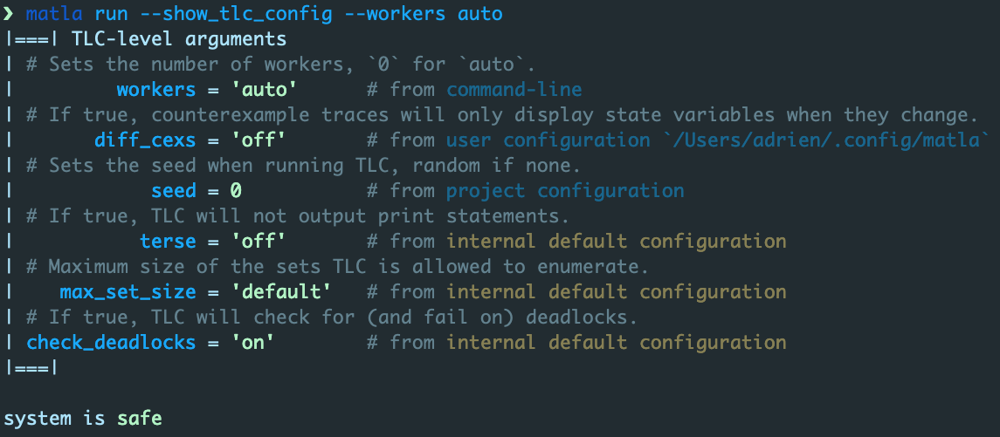

# User/project configuration and command-line arguments

> This chapter builds on the toy project discussed in the [previous chapter](../project). It might
> be useful to be familiar with it, especially if this is your first time reading this.

As discussed in the [previous chapter](../project), matla has a three-level configuration
hierarchy.

- **1)** user configuration: `$HOME/.config/matla/matla.toml` (none in `--portable`/`-p` mode);
- **2)** project configuration: `project/directory/Matla.toml`;
- **3)** command-line arguments passed to `matla run` calls.

Basically, for any configuration item, `matla run` uses the value set by the highest configuration
level in this hierarchy; if none, then the item's internal default value is used.

</br>

Let's see this in action. Say that, as a user, you wish the TLC-level seed controling TLC's RNG to
be random (matla's default is `auto`) and you want exhaustive counterexample traces (off by
default).

> *Exhaustive traces* display all state variables for all states. *Diff traces* on the other hand
> show the value of state variable `svar` in state `s_i` if either
> - `i = 0`,
> - `s_i` is the last state of the trace, or
> - `svar`'s value in `s_i` is different from its value in `s_{i-1}`.

To set this configuration, modify your user configuration file:

```toml
> bat ~/.config/matla/matla.toml
──────┬────────────────────────────────────────────────────────────────────────
      │ File: ~/.config/matla/matla.toml
──────┼────────────────────────────────────────────────────────────────────────
  1   │ [config]
  2   │ tla2tools = '~/.config/matla/tla2tools.jar'
  3   │
  4   │ [tlc_cla]
  5   │ seed = 'random'
  6   │ diff_cexs = 'off'
  7   │
──────┴────────────────────────────────────────────────────────────────────────
```

Going back to our running stopwatch example, we launch `matla run` again but this time ask it to
print its TLC-level configuration.

```text
> exa
Matla.tla  Matla.toml  sw_0.cfg  sw_0.tla  target

> bat sw_0.cfg
───────┬────────────────────────────────────────────────────────────────────────
       │ File: sw_0.cfg
───────┼────────────────────────────────────────────────────────────────────────
   1   │ INIT init
   2   │ NEXT next
   3   │
   4   │ INVARIANTS
   5   │     inv_cnt_pos
   6   │     inv_reset
───────┴────────────────────────────────────────────────────────────────────────

> bat Matla.toml
───────┬────────────────────────────────────────────────────────────────────────
       │ File: Matla.toml
───────┼────────────────────────────────────────────────────────────────────────
   1   │ [project]
   2   │ # # Full configuration for TLC runtime arguments customization
   3   │ #
   4   │ # # Sets the number of workers, `0` or `auto` for `auto`.
   5   │ # workers = 0 # <int|'auto'>#
   6   │ # # If active, counterexample traces will only display state variables when they change.
   7   │ # diff_cexs = 'on' # <'on'|'off'|'true'|'false'>#
   8   │ # # Sets the seed when running TLC, random if none.
   9   │ # seed = 0 # <int|'random'>#
  10   │ # # If active, TLC will not output print statements.
  11   │ # terse = 'off' # <'on'|'off'|'true'|'false'>#
  12   │ # # Maximum size of the sets TLC is allowed to enumerate.
  13   │ # max_set_size = 'default' # <u64|'default'>#
  14   │ # # If active, TLC will check for (and fail on) deadlocks.
  15   │ # check_deadlocks = 'on' # <'on'|'off'|'true'|'false'>#
  16   │ # # If active, matla will present the callstack on errors, whenever possible.
  17   │ # print_callstack = 'off' # <'on'|'off'|'true'|'false'>#
  18   │ # # If active, matla will present time statistics during runs.
  19   │ # timestats = 'off' # <'on'|'off'|'true'|'false'>
───────┴────────────────────────────────────────────────────────────────────────
```



The configuration reported by matla is the expected one: everything is default since the project
configuration and `matla run`'s command-line arguments do not specify anything.

</br>

Say now that the project leader wants to fix TLC's seed and fix the number of workers to `1`
(matla's default is `'auto'`) to have (more) reproducible analyses output. So, they modify the
project's configuration:

```text
> bat Matla.toml
───────┬────────────────────────────────────────────────────────────────────────
       │ File: Matla.toml
───────┼────────────────────────────────────────────────────────────────────────
   1   │ [project]
   2   │ seed = 0
   3   │ workers = 1
───────┴────────────────────────────────────────────────────────────────────────
```

Let's run matla again:



As expected, the seed configuration item set by your user configuration is overwritten by the
project's configuration, while your `diff_cexs` item is still the way you set it up. Item `workers`
is not an override since you did not specify it in your user configuration file, it's just the
setting specified by the project.

<br/>

Last, let's assume you're tired of your analyses taking forever because the project configuration
forces TLC to use a single worker, causing you to hate your project leader. You thus override the
`workers` item in you call to matla:



Neat! You can now bypass your project leader's setup without them ever knowing about it.
